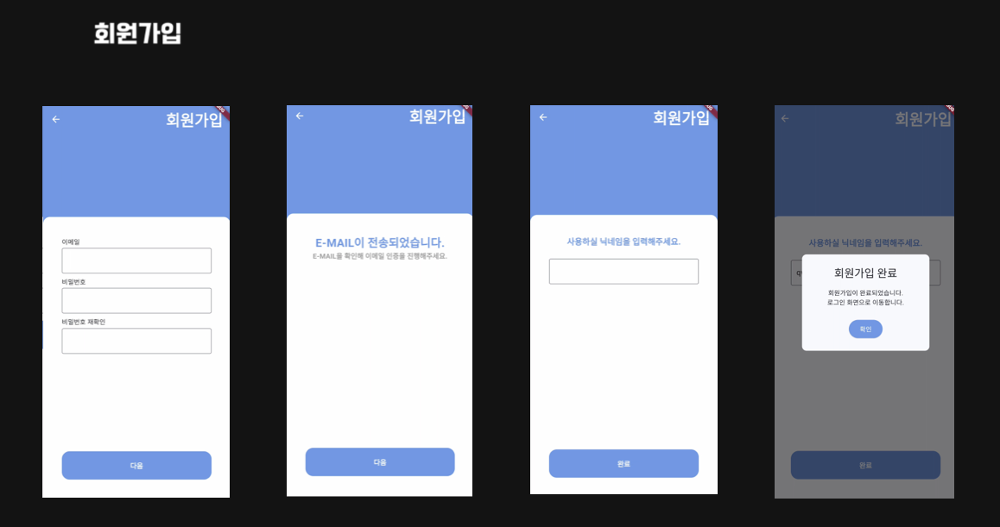
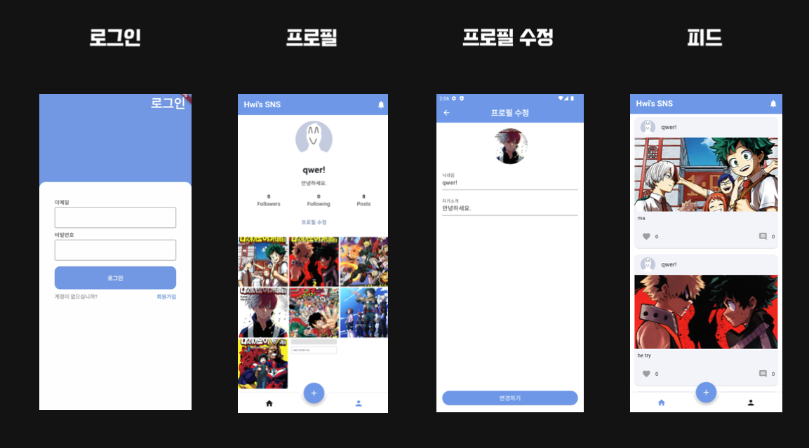
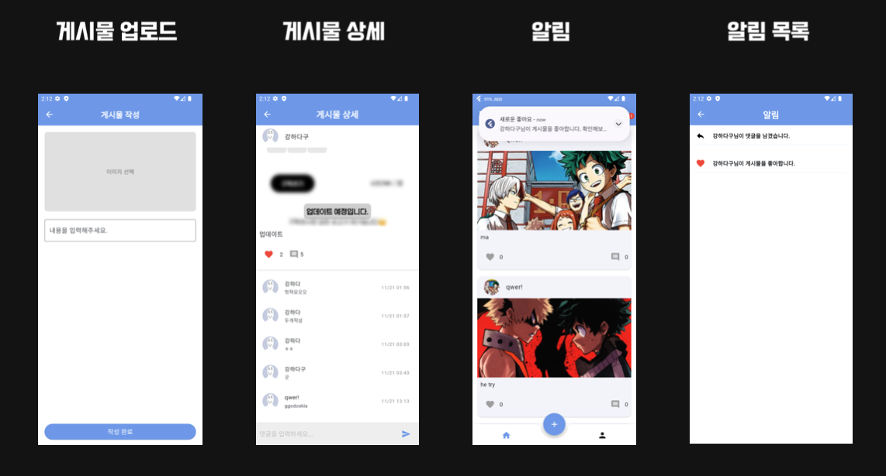
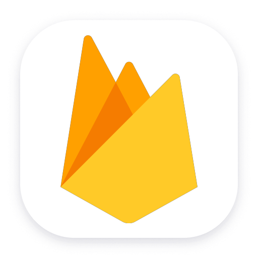

# SNS APP
<div align=center style="display: flex; justify-content: center; align-items: center;flex-direction: column;">
    <div>
      
      
    </div>
    <div align="center">
        
        
    </div>
</div>


## 📃 목차 
- [SNS APP](#sns-app)
  - [📃 목차](#-목차)
  - [💁 프로젝트 소개](#-프로젝트-소개)
  - [📱 스크린샷](#-스크린샷)
  - [⚙️ 사용한 기술 스택](#️-사용한-기술-스택)
  - [🏗️ 디렉토리 구조](#️-디렉토리-구조)
  - [🚩 성과](#-성과)
  - [😎 팀원](#-팀원)

<br>

## 💁 프로젝트 소개
**"Firestore와 Firebase Cloud Messaging, Cloud Functions를 활용해 실시간 알림을 제공하는 SNS APP"**
- 이미지와 함께 게시물을 작성하고, 사용자들의 댓글과 좋아요 이벤트에 대한 실시간 알림을 제공하는 간단한 SNS 앱

<br>

## 📱 스크린샷
<div align="center">
  
  &nbsp;&nbsp;&nbsp;
  
  &nbsp;&nbsp;&nbsp;
  
</div>

<br>

## ⚙️ 사용한 기술 스택
- ### Front
    
    &nbsp;&nbsp;&nbsp;
    
  
  | Package              | Purpose                                                            |
  | -------------------- | -------------------------------------------------------------------|
  | `flutter_riverpod`   | 상태 관리를 위해 사용                                                   |
  | `shared_preferences` | 간단한 데이터를 로컬에 저장하기 위해 사용(로그인 상태, UserId 등)                |
  | `go_router`          | 화면 전환 관리를 위해 사용                                               |
  | `get_it`             | 의존성 관리를 위해 사용                                                  |

  
- ### Back
    
    &nbsp;&nbsp;&nbsp;

  | Package              | Purpose                                                            |
  | -------------------- | -------------------------------------------------------------------|
  | `firebase_auth`      | Firebase Authentication을 이용한 회원가입 진행을 위해 사용                 |
  | `cloud_firestore`| Firestore를 이용해 사용자 정보, 게시글, 알림 등의 데이터 저장하기 위해 사용|
  | `firebase_messaging` | 좋아요, 댓글 알림을 사용자에게 보내기 위해 사용                              |
  | `cloud_functions` | 좋아요, 댓글 이벤트가 발생하고, Firestore에 변경사항을 감지해 해당 사용자에게 알림을 보내기 위해 사용|
  | `firebase_storage` |사용자가 업로드한 게시물의 사진을 저장하고, 관리하기 위해 사용                      |
  

  <br>
- ### 협업도구
    
    &nbsp;&nbsp;&nbsp;
    
    &nbsp;&nbsp;&nbsp;
    
    &nbsp;&nbsp;&nbsp;
<br>

## 🏗️ 디렉토리 구조
```
├── core
│   ├── constants
│   │   ├── colors.dart
│   │   └── sizes.dart
│   ├── di
│   │   └── injector.dart
│   ├── manager
│   │   ├── alert_manager.dart
│   │   └── shared_preferences_manager.dart
│   └── router
│       └── router.dart
├── data
│   ├── datasources
│   │   ├── signin
│   │   └── signup
│   ├── models
│   │   ├── comment_model.dart
│   │   ├── notification_model.dart
│   │   ├── post_model.dart
│   │   └── user_model.dart
│   └── repositories
│       ├── signin
│       ├── signup
│       └── user
├── domain
│   ├── repositories
│   │   ├── signin
│   │   └── signup
│   └── usecases
│       ├── signin
│       └── signup
├── firebase_options.dart
├── main.dart
└── presentation
    ├── screens
    │   ├── app
    │   ├── create_post
    │   ├── feed
    │   ├── notification
    │   ├── post_detail
    │   ├── profile
    │   ├── signin
    │   └── signup
    └── widgets
        ├── bottom_nav_bar.dart
        ├── comment_card.dart
        ├── custom_appbar.dart
        ├── custom_floating_button.dart
        ├── gesture_button.dart
        ├── label_textfield.dart
        └── post_card.dart
```

<br>

## 🚩 성과
* FCM과 Cloud Functions를 통해 실시간 알림을 제공하는 방법을 알 수 있었습니다.
  1. 초기화
        ```dart
        Future<void> _initializeFCM() async {
        // 앱이 실행중이 아닐 경우, 메세지를 처리하는 핸들러를 추가
        FirebaseMessaging.onBackgroundMessage(_firebaseMessagingBackgroundHandler);
        // Flutter Local Notification을 초기화
        final flutterLocalNotificationsPlugin = FlutterLocalNotificationsPlugin();
        // 안드로이드 알림 채널 생성 ( 8.0 이상에서 필수 )
        await flutterLocalNotificationsPlugin
            .resolvePlatformSpecificImplementation<
                AndroidFlutterLocalNotificationsPlugin>()
            ?.createNotificationChannel(const AndroidNotificationChannel(
                'high_importance_channel', 'high_importance_notification',
                importance: Importance.max));
        await flutterLocalNotificationsPlugin.initialize(const InitializationSettings(
            android: AndroidInitializationSettings("@mipmap/ic_launcher")));
        // Foreground 상태에서도 표시하기 위한 옵션 설정 
        await FirebaseMessaging.instance.setForegroundNotificationPresentationOptions(
            alert: true, badge: true, sound: true);
        }
        ```
  2. Cloud Functions를 초기화, index.js 작성
    * 예시 ) 좋아요 이벤트에 대한 트리거를 설정 ( firestore에 document 생성 )
        ```javaScript
        exports.sendLikeNotification = onDocumentCreated(
            "/posts/{postId}/likes/{uid}",
            async (event) => {
                /*
                [feed_notifier.dart]
                likeDocRef.set({
                    'userId': userId,
                    'likedAt': FieldValue.serverTimestamp(),
                    'nickname': nickname,
                });
                likesDoc에 위의 코드를 통해 좋아요를 클릭한 유저가 추가된다.
                */
                // event -> onDocumentCreated("/posts/{postId}/likes/{uid}")
                // event.parms -> { postId: ..., uid: ... }
                const postId = event.params.postId; 
                const uid = event.params.uid;
                /*
                "/posts/{postId}/likes/{uid}" 경로에 생긴 데이터를 말한다.
                event.data -> {
                    "userId": ...,
                    "likedAt": ...,
                    "nickname": ...
                }
                */
                const likeData = event.data.data();
                const postSnapshot = await admin.firestore().collection("posts").doc(postId).get();
                const post = postSnapshot.data();
                const authorId = post.uid;
                // 자신이 작성한 게시물에 좋아요를 눌렀을 때는 알림 처리 X
                if (authorId === uid) {
                    return;
                }
                // 게시자에게 알림 보내기
                const userSnapshot = await admin.firestore().collection("users").doc(authorId).get();
                const authorData = userSnapshot.data();
                const token = authorData.fcmToken;
                const message = {
                    notification: {
                        title: "새로운 좋아요",
                        body: `${likeData.nickname}님이 게시물을 좋아합니다.\n확인해보세요 :)`,
                    },
                    token: token,
                    // 타입을 통해 아이콘 초기화
                    // ID를 통해서 화면전환, 게시물 내용 표시
                    data: {
                        type: "like",
                        postId: postId,
                    },
                };
                // FCM이 메세지를 보내는 코드
                await admin.messaging().send(message);

                const notification = {
                    type: "like",
                    postId: postId,
                    userId: uid,
                    message: `${likeData.nickname}님이 게시물을 좋아합니다.`,
                    createdAt: admin.firestore.FieldValue.serverTimestamp(),
                };
                // firestore에도 user의 notification 컬렉션에 추가해주기
                await admin.firestore().collection("users").doc(authorId).collection("notifications").add(notification);
            },
        );
        ```
    3. FCM 리스너를 설정하고, 처리
     * appNotifier.dart 에서 알림 수신시 화면에 표시될 알림 갯수를 수정한다.
  
        ```dart
        FirebaseMessaging.onMessage.listen((RemoteMessage message) async {
            RemoteNotification? notification = message.notification;
            if (notification != null) {
                FlutterLocalNotificationsPlugin().show(
                    notification.hashCode,
                    notification.title,
                    notification.body,
                    const NotificationDetails(
                        android: AndroidNotificationDetails(
                        'high_importance_channel',
                        'high_importance_notification',
                        importance: Importance.max,
                    )));
                // 갯수 추가 + 저장 데이터 업데이트
                int count = state.notificationCount;
                state = state.copyWith(notificationCount: count + 1);
                SharedPreferenceManager()
                    .setPref<int>(PrefsType.unReadNotificationCount, count + 1);
            }
        });
        ```

## 😎 팀원
  <table>
    <tr>
      <td>
      <a href="https://www.flaticon.com/kr/free-icons/" title="소녀 아이콘 제작자: Freepik - Flaticon">
      
      </td>
      <td width="300px">
        <a href="https://github.com/yuri-door">
          진유리
        </a>
        <br />
        - 프로필 화면 & 프로필 수정 화면 구현<br>
        - 게시물 생성 화면 구현<br>
      </td>
      </a>
    </tr>
  </table>
  <table>
    <tr>
      <td>
      <a href="https://www.flaticon.com/kr/free-icons/" title="남자 아이콘 제작자: Freepik - Flaticon" target="_blank">
        
      </a>
      </td>
      <td width="400px">
        <a href="https://github.com/9oHigh">
          이경후
        </a>
        <br />
        - 회원가입 및 로그인 화면 및 기능 구현<br>
        - 피드 화면 및 기능 구현<br>
        - Firestore, cloud storage 구축하고 관련 로직 추가(Create, Read)<br>
        - Cloud Functions를 통해 알림 자동화 구축<br>
      </td>
    </tr>
  </table>